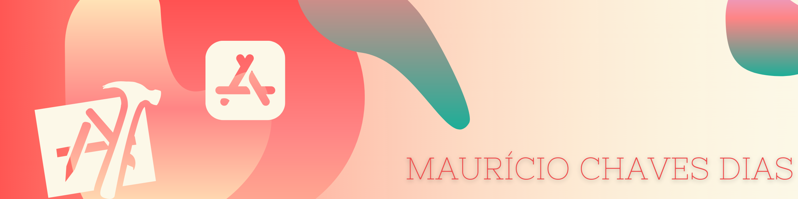

#  Destini

## Description

A “choose your own adventure” game similar to the App Store hit “Life Line” app. The app will tell a story depending on what the you choose and can be fleshed out and modified to provide an engaging story-telling experience

## Screenshot

      

## What you I learned with this app

* How to programmatically change UI elements such as Labels and Buttons.
* What is a design pattern and how is it used in programming.
* How to use the Model-View-Controller or MVC pattern for app development.
* Learn about Swift Structures how to instantiate a struct instance.
* Understand the difference between value types and reference types. 
* Learn about Swift Classes and creating Objects.
* Compare Swift Classes with Swift Structs and know when to use which.
* Learn about Object Oriented Programming.
* How to refactor code and stay organised.

>This is a companion project to The App Brewery's Complete App Development Bootcamp, check out the full course at [www.appbrewery.co](https://www.appbrewery.co/)

